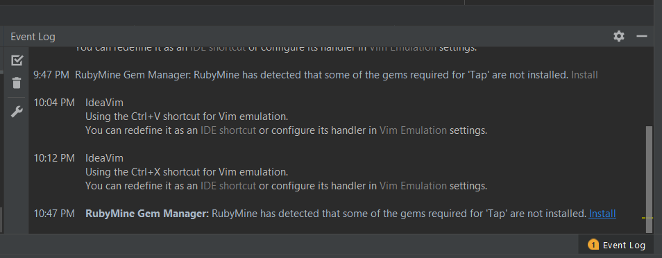

# Windows installation

This project can't be run with the latest ruby version. With rbenv you can install multiple  ruby versions on your pc. 

## Rbenv install

This is a very simple install, just run the cmd bat script as administrator from https://gist.github.com/nak1114/7ea63204203883c5884d

Now in a new in a new command prompt run the following commands:

```
`rbenv rehash`
```

 Note: 7z can ask you to extract an archive, simple click extract

## SSL problem

Sometimes rbenv doesn't install the root certificate, so you can't download any gems.

follow these steps for the fix https://bundler.io/v1.16/guides/rubygems_tls_ssl_troubleshooting_guide.html#updating-ca-certificates

## Use the ruby interpreter in ruby mine ide

Go to file->settings

Under "Ruby SDK and gems", click on the plus sign to add a new local.

The path shouled something of the following. (copy the path first in windows explorer, then the %USERPROFILE% gets automatically replaced)

```
%USERPROFILE%\.rbenv-win\versions\2.3.3-x64\bin
```

now select the ruby.exe and set the interpreter on for the project.



Ruby mine, will detect it has some uninstalled gems, click on install. Then click on "ok", "install". Now ruby Mine will install Bundler and all the gems specified in the gem file.

you will get a warning about bundle.bat, just ignore it.

Now "views"->"tool windows"->"terminal" will open a terminal, run the following command `rake db:migrate` .

Now you can just run the project (shift + F10)

## References

https://bundler.io/v1.16/guides/rubygems_tls_ssl_troubleshooting_guide.html#updating-ca-certificates

https://github.com/nak1114/rbenv-win